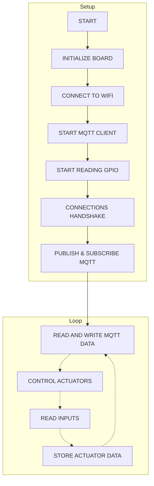

#### LilyGo T-Display mqtt tester

> Purpose of this project is to get data from sensors and send it throught MQTT to be processed in backend and then return data back to board to control connected actuators

#### TTGO T-Display GPIO pinout

#### ESP32 GPIO 34-39 are input only 
> Note! On Lilygo TTGO T-Display there are only pins 36-39 

